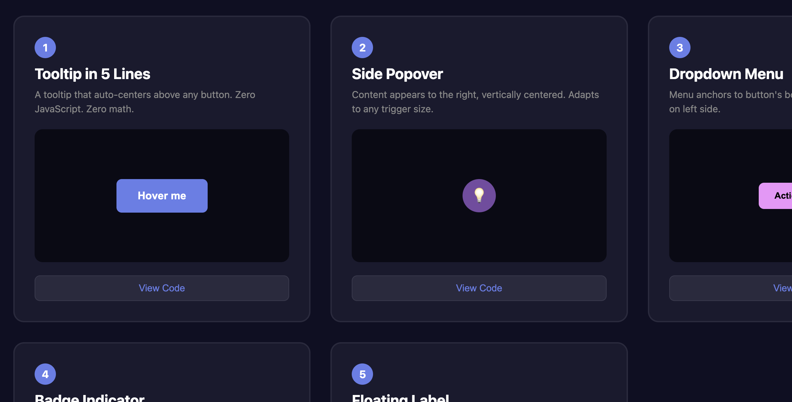

# css-anchor-positioning

A small demo repository that shows examples of CSS anchor-based positioning: a hover-centered tooltip, side popover, dropdown menu, badge indicator, and floating label.

Live demo
--

- Demo: https://mrkteq-anchor-positioning.netlify.app

What you'll find in this repo
--

- Tooltip: hover-centered tooltip that auto-centers above any button.
- Side Popover: content appears to the right of a trigger, vertically centered.
- Dropdown Menu: menu anchored to a button's bottom edge.
- Badge Indicator: notification badge pinned to a card corner.
- Floating Label: label anchored to an input, shown on focus/filled.

Tech stack
--

- HTML (static demo pages)
- CSS (modern layout and anchor positioning) no build step required
- Minimal JavaScript for UI toggles (code sample reveal)
- Optional tooling: `svgo` (used to optimize SVG assets)